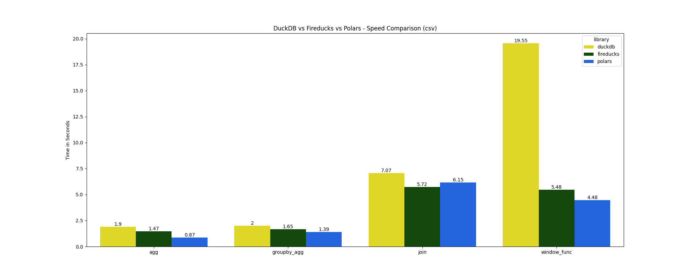

# DuckDB vs Polars vs FireDucks Benchmark

A benchmark comparing DuckDB, Polars, and FireDucks for simple data operations. Check out the [blog post](https://open.substack.com/pub/thedatatoolbox/p/duckdb-vs-fireducks-vs-polars-which?r=1h2ayd&utm_campaign=post&utm_medium=web&showWelcomeOnShare=true) for more details.

## Project Structure

```
duckdb_vs_polars_vs_fireducks/
├── __init__.py
├── __main__.py
├── config.py
├── utils.py
├── visualize_output.py
├── data/                # Data directory
│   ├── .gitkeep        # Ensures data directory exists in git
│   ├── 2023_Yellow_Taxi_Trip_Data.csv     # Required CSV file (3.78 GB)
│   └── 2023_Yellow_Taxi_Trip_Data.parquet # Optional Parquet file (773.4 MB)
└── queries/
    ├── __init__.py
    ├── agg_*.py         # Simple aggregation queries
    ├── groupby_agg_*.py # GroupBy aggregation queries
    ├── join_*.py        # Join queries
    └── window_func_*.py # Window function queries
tests/
├── __init__.py
└── test_output.py      # Tests for all query implementations
```

## Data
The benchmark uses the [2023 NYC Yellow Taxi Trip Data](https://data.cityofnewyork.us/Transportation/2023-Yellow-Taxi-Trip-Data/4b4i-vvec/about_data) that contains 30M rows with 18 columns. 

Place your data file(s) in the `data` directory:
- Required: `data/2023_Yellow_Taxi_Trip_Data.csv` (3.78 GB)
- Optional: `data/2023_Yellow_Taxi_Trip_Data.parquet` (773.4 MB) - Only if you want to test Parquet format. You can also convert the CSV to Parquet using the `convert_csv_to_parquet.py` script.

Note: The `data` directory is included in the repository but the data files are gitignored. You'll need to download and place the files manually.

## Libraries Compared

- **DuckDB**: A high-performance analytical database
- **Polars**: Fast DataFrame library written in Rust
- **FireDucks**: A faster, drop-in replacement for pandas

## Benchmark Queries

1. **Simple Aggregation**: Basic aggregations (sum, mean, min, max) on the `total_amount` column
2. **GroupBy Aggregation**: Aggregations (sum, mean, min, max) of `total_amount` grouped by `VendorID` and `payment_type`
3. **Join**: Join the original table with aggregated `total_amount` sums (grouped by `VendorID`, `payment_type`, and pickup month)
4. **Window Functions**: Two window calculations:
   - Average `fare_amount` per `VendorID`
   - Dense rank of trips by `total_amount` within each `payment_type` partition

## Running the Benchmarks

- FireDucks requires the use of [Linux (manylinux) on the x86_64 architecture](https://fireducks-dev.github.io/docs/get-started/)
- Using docker is recommended as it ensures consistent results across different systems.

### Using Docker Compose

```bash
# Run with CSV file (default)
docker compose up

# Run with Parquet file
FILE_TYPE=parquet docker compose up

# Run tests
docker compose run app uv run pytest
```

You can adjust the container's resource allocation in the `docker-compose.yml` file:

```yaml
services:
  app:
    // ... existing config ...
    deploy:
      resources:
        limits:
          cpus: '4'    # Limit to 4 CPU cores
          memory: 8G   # Limit to 8GB RAM
```

### Using Dev Container

1. Open the project in VS Code
2. Install the "Dev Containers" extension
3. Click the button in the bottom-left corner and select "Reopen in Container"
4. Once inside the container:
   ```bash
   # Run with CSV file (default)
   uv run python duckdb_vs_polars_vs_fireducks

   # Or run with Parquet file (if you've created it)
   uv run python duckdb_vs_polars_vs_fireducks --file-type parquet

   # Run tests
   uv run pytest
   ```

## Results

Results show execution times in seconds for each operation across the different libraries. This was run on a EC2 instance with 64GB RAM and 16 vCPUs and 16GB of EBS volume (m6i.4xlarge).


### CSV Results


### Parquet Results


## Notes

- The benchmark evaluates in-memory execution and does not test streaming or out-of-RAM processing.
- Benchmarking DuckDB queries uses `.arrow()` to materialize results, as it was the fastest among `.arrow()`, `.pl()`, `.df()`, and `.fetchall()`.
    - While `.execute()` could be used, it might not properly reflect full execution time as the final pipeline won't execute until a result collecting method is called.
    - For more details on DuckDB materialization, see [this Discord discussion](https://discord.com/channels/909674491309850675/921100786098901042/1217841718066413648).
- Polars uses `.collect()` to materialize results.
- FireDucks uses `._evaluate()` to ensure query execution.
- The benchmark uses the newest versions of each library as of 03/10/2025.
- All libraries were tested with their default settings and no manual optimizations.
- The goal was to compare "out of the box" performance with straightforward query implementations.
